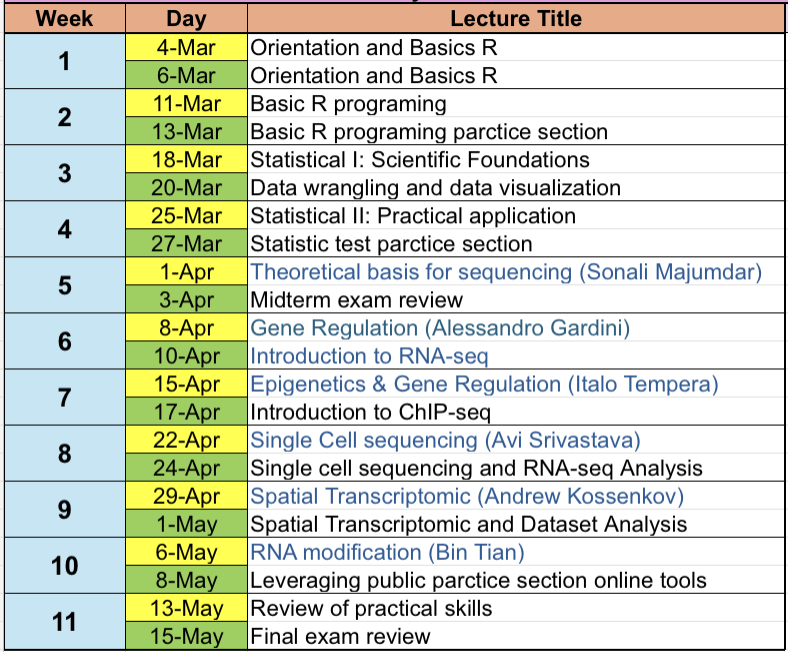

# Wistar Bioinformatics Class Spring 2025

The Wistar Bioinformatics Class  is a 11-week research training program for PCOM students interested in learning scientific biological data analysis.

---

## Schedule

---

## Getting Started

### Programs to Install

1. Slack <https://slack.com/>, our slack name is `wistar_bioinfo_spring2025`. 
2. R  <https://cloud.r-project.org/> to download and install R.
3. RStudio <https://rstudio.com/products/rstudio/download/> and download the FREE version.

---

###  Lecture Material

#### **Week 1** Orientation and Basics R

##### Welcome and Introduction to Rmarkdown and RStudio

- Introduction to Bioinformatics Research
- Introduction to Rmarkdown and RStudio
- [slides]()
- demo [Rmd]() and its html [html]()

---

#### **Week 2:** Basic R programing 

##### Tuesday - Basic R programing

 - [slides]()

##### Thursday -  Basic R programing parctice section

- [slides]()

- demo [Rmd]() and its html [html]()

---

#### **Week 3:** 
##### Tuesday - Statistical I: Scientific Foundations 

- [slides]()

##### Thursday -  Data wrangling and data visualization

- [slides]()
- demo [Rmd]() and its html [html]()

---

#### **Week 4:** 

##### Tuesday - Statistical II: Practical application

- [slides]()

##### Thursday -  Statistic test parctice section 

- [slides]()
- demo [Rmd]() and its html [html]()

---

#### **Week 5:** Statistics Review and Tidying R Statistical Tests with `broom`

##### Tuesday - Theoretical basis for sequencing (Sonali Majumdar)

- [slides]()

##### Thursday -  Midterm exam review  

- [test]()

---

#### **Week 6:** Clustering Data

##### Tuesday - Statistical II: Gene Regulation (Alessandro Gardini)

- [slides]()

##### Thursday -  Introduction to RNA-seq 

- [slides]()
- demo [Rmd]() and its html [html]()

---

#### **Week 7:** Statistics 2: Linear Models

##### Tuesday - Epigenetics & Gene Regulation (Italo Tempera)

- [slides]()

##### Thursday -  Introduction to ChIP-seq

- [slides]()
- demo [Rmd]() and its html [html]()

---

#### **Week 8:** Exploratory Data Analysis

##### Tuesday - Single Cell sequencing (Avi Srivastava)

- [slides]()

##### Thursday -  RNA-seq Analysis and Single cell sequencing 

- [slides]()
- demo [Rmd]() and its html [html]()

---

#### **Week 9:** Introduction to RNA-seq

##### Tuesday - Spatial Transcriptomic (Andrew Kossenkov)

- [slides]()

##### Thursday - RNA-seq Analysis and Spatial Transcriptomic

- [slides]()
- demo [Rmd]() and its html [html]()

---

#### **Week 10:** Clustering RNA-seq and Differential Expression Testing

##### Tuesday - RNA modification (Bin Tian)

- [slides]()

##### Thursday -  Leveraging public parctice section online tools

- [slides]()
- demo [Rmd]() and its html [html]()

---

#### **Week 11:** Review of practical skills and Final exam review 

##### Tuesday - Review of practical skills

- [slides]()

##### Thursday -  Final exam review 

- [test]()
